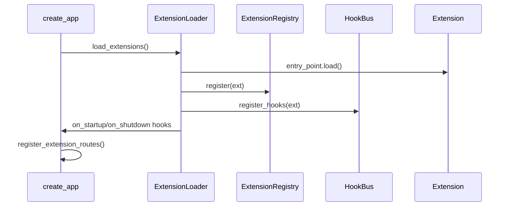

# Extension Architecture

## Overview

The extension framework lives in [`app/extensions/`](../../app/extensions/) and follows these design patterns:

| Pattern | Component |
|---------|-----------|
| Registry | `ExtensionRegistry` — single source of truth |
| Factory | `ExtensionLoader` — discovers entry points |
| Observer | `HookBus` — async event fan-out |
| Facade | `ExtensionContext` — safe API for extensions |
| Adapter | `register_extension_routes()` — mounts routers and static assets |
| Template Method | `BaseExtension` — optional capability overrides |

## Lifecycle

## Security model

- **Allowlist**: only IDs in `EXTENSIONS_ALLOWLIST` load (empty = all discovered).
- **RBAC**: `extensions.read` and `extensions.manage` permissions.
- **Owner-only**: enable/disable extensions.
- **Hook isolation**: handler failures are logged, never propagated.
- **Facade**: extensions should use `ExtensionContext`, not raw CRUD imports.

## Data storage

- `extension_settings` — per-extension JSON settings and enabled flag.
- `extension_migrations` — applied revision tracking.
- Extension-owned tables must use prefix `ext_{extension_id_snake}_`.

## Future extraction

The protocols and models in `app/extensions/` are designed to be extractable into a standalone `pasarguard-ext` PyPI package.
